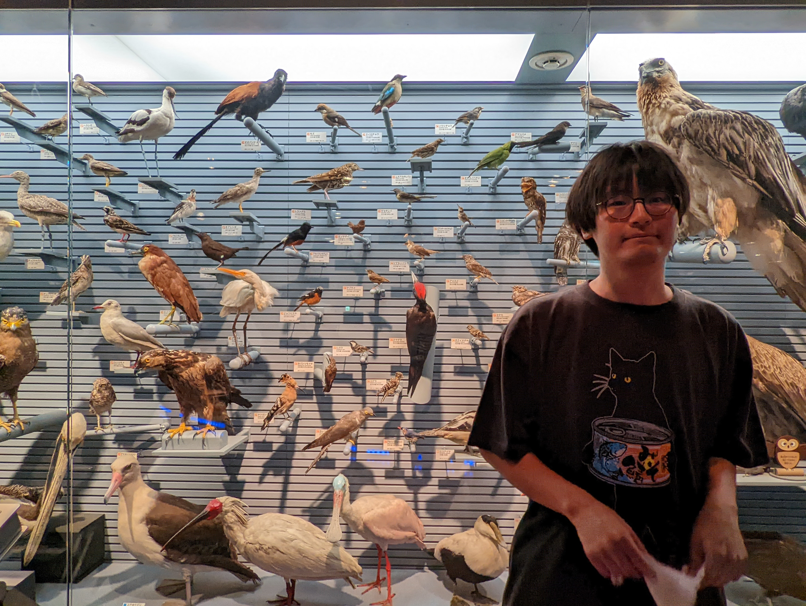

```{r, echo = F}
library(metathis)
meta_tag(name = "description", content = "Website of Jun Ishigohoka")
meta_tag(name = "google-site-verification", content = "e7CWREuNtcnqSf0gkxQMhUh2fazfCwWYiXnfgf2umDI")

```

I am a doctoral researcher with broad interests in **evolutionary biology and animal behaviour**.
I work on **population genomics and single cell brain epigenomics** to understand how population-typical phenotypes of **seasonal migration** evolved in a songbird species, blackcap (*Sylvia atricapilla*).

{width=50%}

