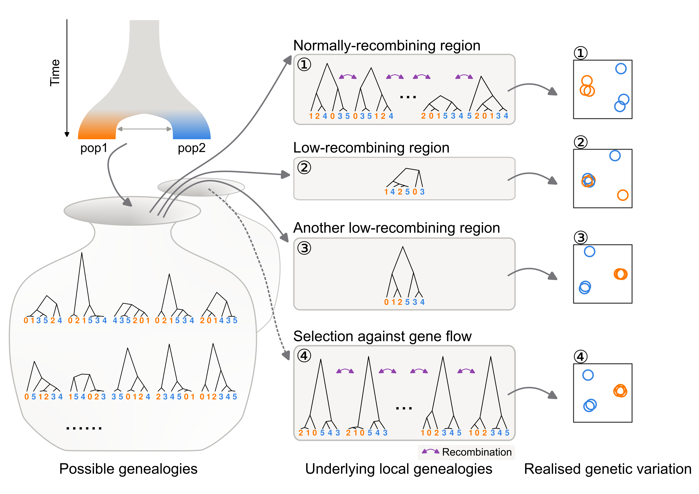

## Long term

I want to understand behavioural evolution by connecting the [Tinbergens's four questions](https://en.wikipedia.org/wiki/Tinbergen%27s_four_questions).

## Short-mid term

My projects so far stem from a big question of how behaviour diverges among populations and species.
I address this by studying micro-evolution of seasonal migration in populations of blackcaps which exhibit a large heritable variation in migratory behaviour across populations from long-distance migrant to resident.

### Population genomics

I use population genomics to understand population history of non-model organisms.
Through this project, I became more interested in how evolution of recombination rates affects local genetic variation and population genetic inferences, and learned to think from the underlying gene genealogies.
I work both on empirical analysis and population genetic simulation.

### Epigenomics

I am interested in molecular regulations associated with behavioural variation in the brain at the level of cell types.
To this end, I perform scATAC-seq on the hypothalamus of migratory and non-migratory blackcaps.

